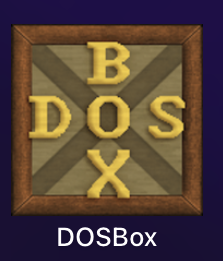
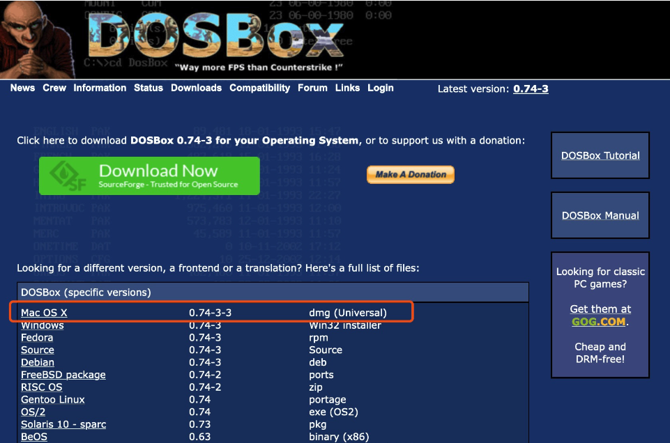
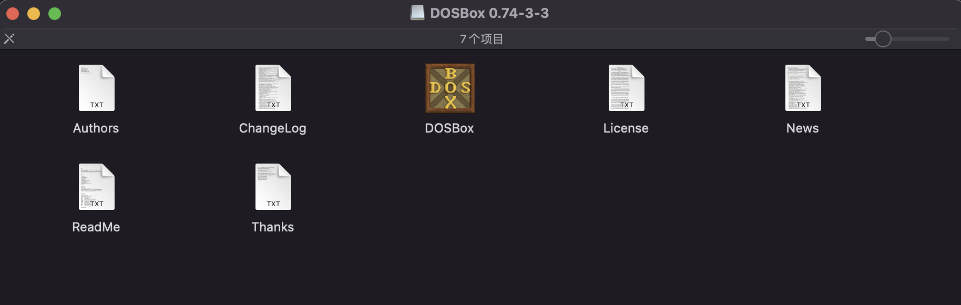
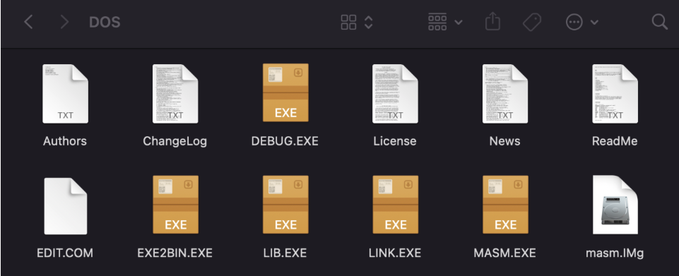
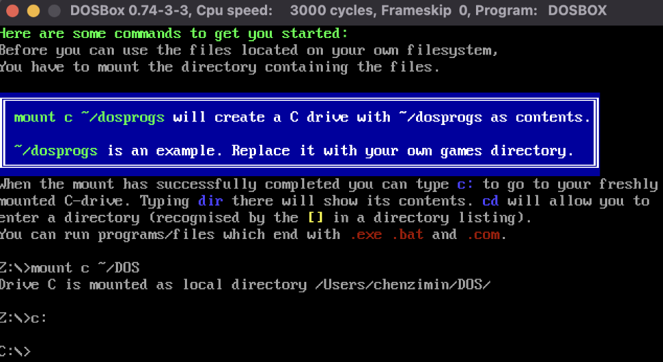
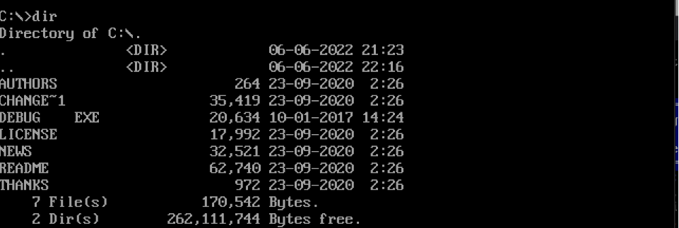
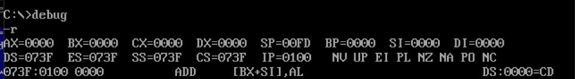
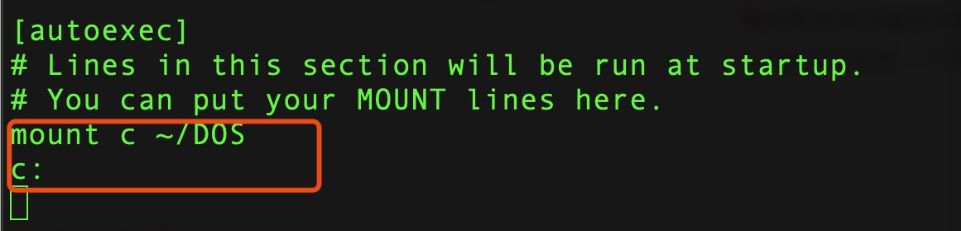

## Mac系统搭建DOSBox汇编环境
### Debug是一个DOS实用程序，是供程序员使用的程序调试工具，苹果的Mac系统上是没有DOS程序的，所以我们要下载一个名为DOSBox的软件进行配置。

<br>

##### 安装DOSBox
- 首先需要去到DOSBox的官网下载工具

- DOSBox包内容如下：

<br>

##### 配置DOSBox
- 在电脑中新建一个文件夹，用来存放DOS需要的文件：
  - 例如：/Users/你的电脑名字/你新建文件夹的名称
  - 我自己建立了一个名为DOSox的文件夹，然后把上面下载的DOSBox包内容文件除了DOSBox.app的都拷贝到DOS文件夹下，再把里面的DOSBox.app文件拖到Mac的应用程序（application）中，最后还需要下载汇编相关工具。汇编工具在仓库的tools.zip文件中，下载完之后解压到/Users/你的电脑名字/你新建文件夹的名称目录下。
  - 最后文件夹中，所有内容如下：

<br>

##### 使用DOSBox工具
- Mac中没有分C盘D盘，所以要自己mount(挂载)一个，输入intro mount，会有引导我们mount一个C盘。
  - 常见命令行：
  ```shell
  mount c ~/DOS // 挂载C盘命令：【mount c 路径】
  c:一个空格 // 进入c盘
  dir // 查看目录下的文件内容
  debug // 开启dubeg模式，可以开始汇编了
  ```
- 全屏/退出全屏：option+enter



<br>

##### DOSBox自动化配置
```shell
#进入到文件配置目录
cd /Users/chenzimin/Library/Preferences 
#打开配置文件，划到最底部，添加配置
vim DOSBox\ 0.74-3-3\ Preferences 
#添加如下代码
mount c ~/DOS
c:
#具体添加位置如下图
```


##### 编写第一个汇编程序
```shell
#进入编辑模板
edit test.asm 

#编写汇编代码
code segment 
		assume cs:code
	start:
		mov ax,1111H
		mov bx,2222H
		add ax,bx
		mov ah,4ch
		int 21h
code ends
		end start
#成功后按option+f 保存代码

#用masm.exe编译代码
masm test.asm 
#然后可以连按三次回车

#用link.exe链接 
link test.obj 
#依然可以连按三次回车

#执行创建好的程序
debug test.exe 
```