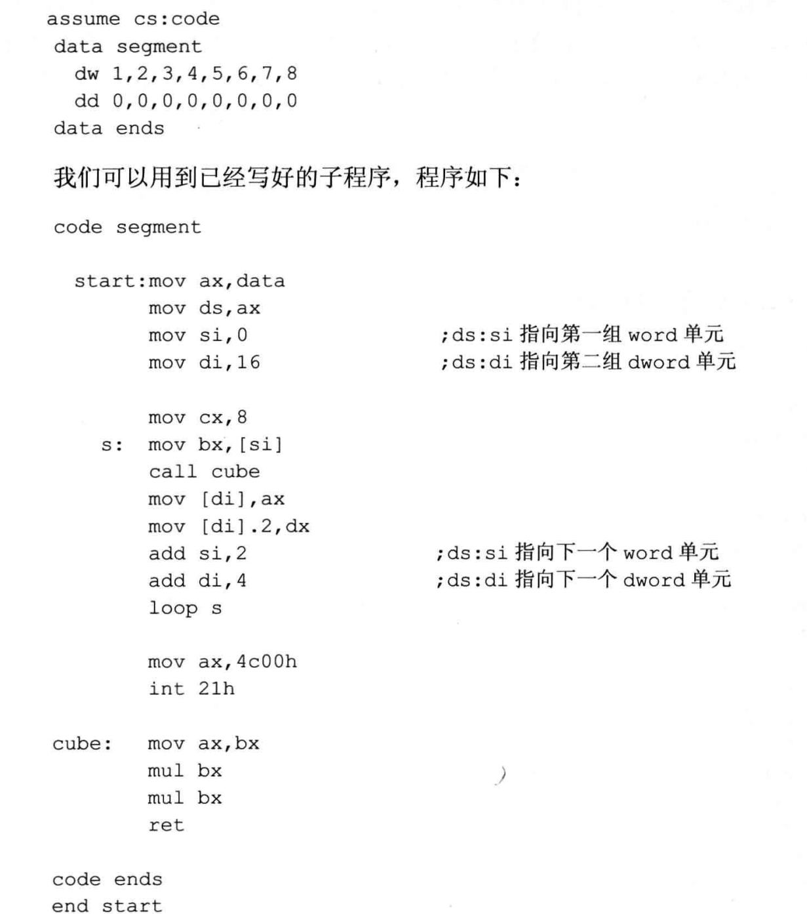

## 参数和结果传递的问题
- 子程序一般都要根据提供的参数处理一定的事务，处理后，将结果(返回值)提供给调用者。其实，我们讨论参数和返回值传递的问题，实际上就是在探讨，应该如何存储子程序需要的参数和产生的返回值。
- 比如，设计一个子程序，可以根据提供的N，来计算N的了次方。
- 这里面就有两个问题:
  - 将参数 N 存储在什么地方？
  - 计算得到的数值，存储在什么地方？
- 很显然，可以用寄存器来存储，可以将参数放到bx 中,因为子程序中要计算N\*N*N，可以使用多个mul指令，为了方便，可将结果放到 dx 和 ax 中。子程序如下:
```asm
;说明:计算口的3次方
;参数:(bx)=N
;结果:(dx:ax)=N^3
cube: mov ax,bx 
      mul bx 
      mul bx 
      ret
```
- 注意，我们在编程的时候要注意形成良好的风格，对于程序应有详细的注释。子程序的注释信息应该包含对子程序的功能、参数和结果的说明。因为今天写的子程序，以后可能还会用到；自己写的子程序，也很可能要给别人使用，所以一定要有全面的说明。

- 用寄存器来存储参数和结果是最常使用的方法。对于存放参数的寄存器和存放结果的寄存器，调用者和子程序的读写操作恰恰相反:
  - 调用者将参数送入参数寄存器，从结果寄存器中取到返回值；
  - 子程序从参数奇存器中取到参数，将返回值送入结果寄存器。
<br>
- 编程，计算 data 段中第一组数据的 了 次方，结果保存在后面一组 dword 单元中:
