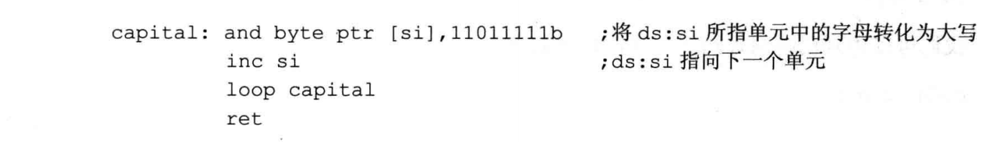
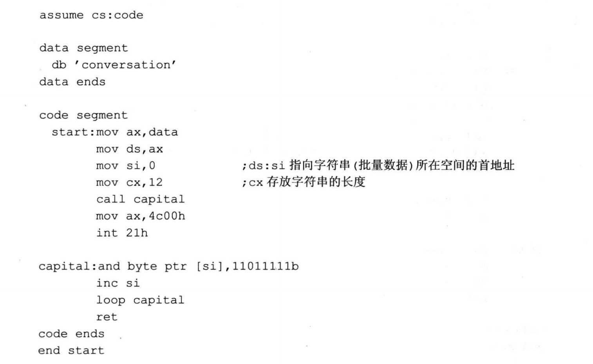

## 批量数据的传递
- 前面的例程中，子程序 cube 只有一个参数，放在bx 中。如果有两个参数，那么可以用两个寄存器来放，可是如果需要传递的数据有了3个、4个或更多直至N个，该怎样存放呢？寄存器的数量终究有限，我们不可能简单地用寄存器来存放多个需要传递的数据。对于返回值，也有同样的问题。
- 在这种时候，我们将批量数据放到内存中，然后将它们所在内存空问的首地址放在寄存器中，传递给需要的子程序。对于具有批量数据的返回结果，也可用同样的方法。
- 下面看一个例子，设计一个子程序，功能:将一个全是字母的字符串转化为大写。
  - 这个子程序需要知道两件事，字符串的内容和字符串的长度。因为字符串中的字母可能很多，所以不便将整个字符串中的所有字母都直接传递给子程序。但是，可以将字符串在内存中的首地址放在寄存器中传递给子程序。因为子程序中要用到循环，我们可以用loop 指令，而循环的次数恰恰就是字符串的长度。出于方便的考虑，可以将字符串的长度放到cx中。

 
 

- 编程，将data段中的字符串转化为大写:

- 还有一种通用的方法是用栈来传递参数
