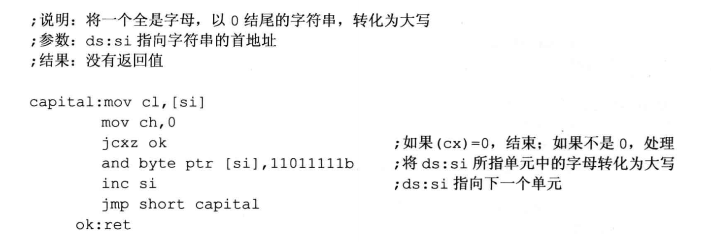
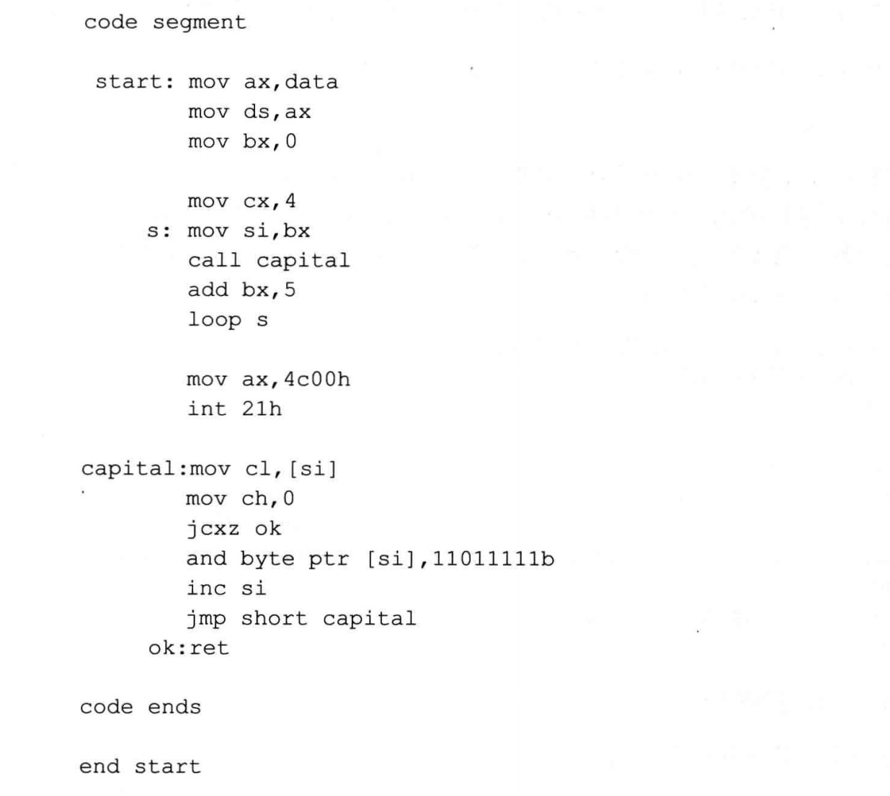
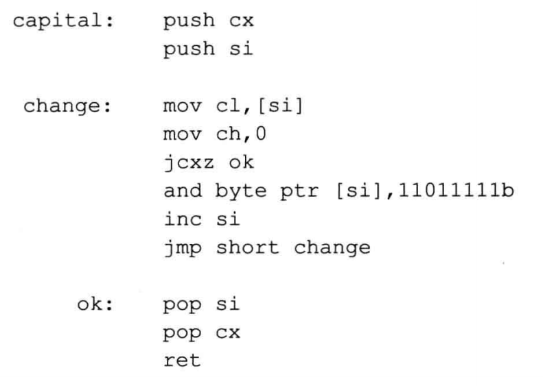

 ## 寄存器冲突的问题
- 设计一个子程序，功能:将一个全是字母，以0结尾的宇符串，转化为大写。程序要处理的字符串以0作为结尾符，这个字符串可以如下定义:
```asm
db "conversation', 0
```
- 应用这个子程序，字符串的内容后面一定要有一个 0，标记字符串的结束。子程序可以依次读取每个字符进行检测，如果不是 0，就进行大写的转化；如果是 0，就结束处理。由于可通过检测 0 而知道是否已经处理完整个字符串，所以子程序可以不需要字符串的长度作为参数。可以用 jcxz 来检测 0。程序示例如下:

- 来看一下上面这个子程序的应用
  - 将data 段中字符串转化为大写。
  ```asm
  assume cs:code 
  data segment
    db 'conversation',O 
  data ends
  ```
  - 代码段中的相关程序段如下:
  ```asm
    mov ax,data 
    mov ds,ax 
    mov si,0
    call capital
  ```
  - 將data段中的字符串全部转化为大写
  ```asm
  assume cs:code 
  data segment 
    db 'word',0
    db 'unix',0
    db 'wind',0
    db 'good',0
  date ends
  ```
- 可以看到，所有字符串的长度都是5(算上结尾符0，使用循环，重复调用子程序capital，完成对4个字符串的处理。完整的程序如下:



## 上面程序出现问题分析
- 这个程序在思想上完全正确，但在细节上却有些错误，把错误找出来。
- 分析：
- 问题在于 cx 的使用，主程序要使用 cx 记录循环次数，可是子程序中也使用了 cx，在执行子程序的时候，cx中保存的循环计数值被改变，使得主程序的循环出错。
- 从上面的问题中，实际上引出了一个一般化的问题: 子程序中使用的寄存器，很可能在主程序中也要使用，造成了寄存器使用上的冲突。那么如何来避免这种冲突呢？粗略地看，可以有以下两个方案:
  - 在编写调用子程序的程序时，注意看看子程序中有没有用到会产生冲突的奇存器，如果有，调用者使用别的寄存器
  - 在编写子程序的时候，不要使用会产生冲突的寄存器。
- 我们来分析一下上面两个方案的可行性:
  - 这将给调用子程序的程序的编写造成很大的麻烦，因为必须要小心检查所调用的子程序中是否有将产生冲突的寄存器。比如说，在上面的例子中，我们在编写主程序的循环的时候就得检查子程序中是否用到了 bx 和 cx，因为如果子程序中用到了这两个寄存器就会出现问题。如果采用这种方案来解决冲突的话，那么在主程序的循环中，就不能使用 ex 寄存器，因为子程序中己经用到。这个方案是不可能实现的，因为编写子程序的时候无法知道将来的调用情况。
  - 可见，我们上面所设想的两个方案都不可行。我们希望
    - 编写调用子程序的程序的时候不必关心子程序到底使用了哪些寄存器
    - 编写子程序的时候不必关心调用者使用了哪些寄存器
    - 不会发生寄存器冲突
  - 解决这个问题的简捷方法是，在子程序的开始将子程序中所有用到的寄存器中的内容都保存起来，在子程序返回前再恢复。可以用栈来保存寄存器中的内容。
- 以后，我们编写子程序的标准框架如下:
  ```asm
  子程序开始：子程序中使用的寄存器入栈
  子程序内容
  子程序中使用的寄存器出栈
  返回(ret、retf）
  ```
<br>

- 我们改进一下子程序 capital 的设计：

- 要注意寄存器入栈和出栈的顺序
