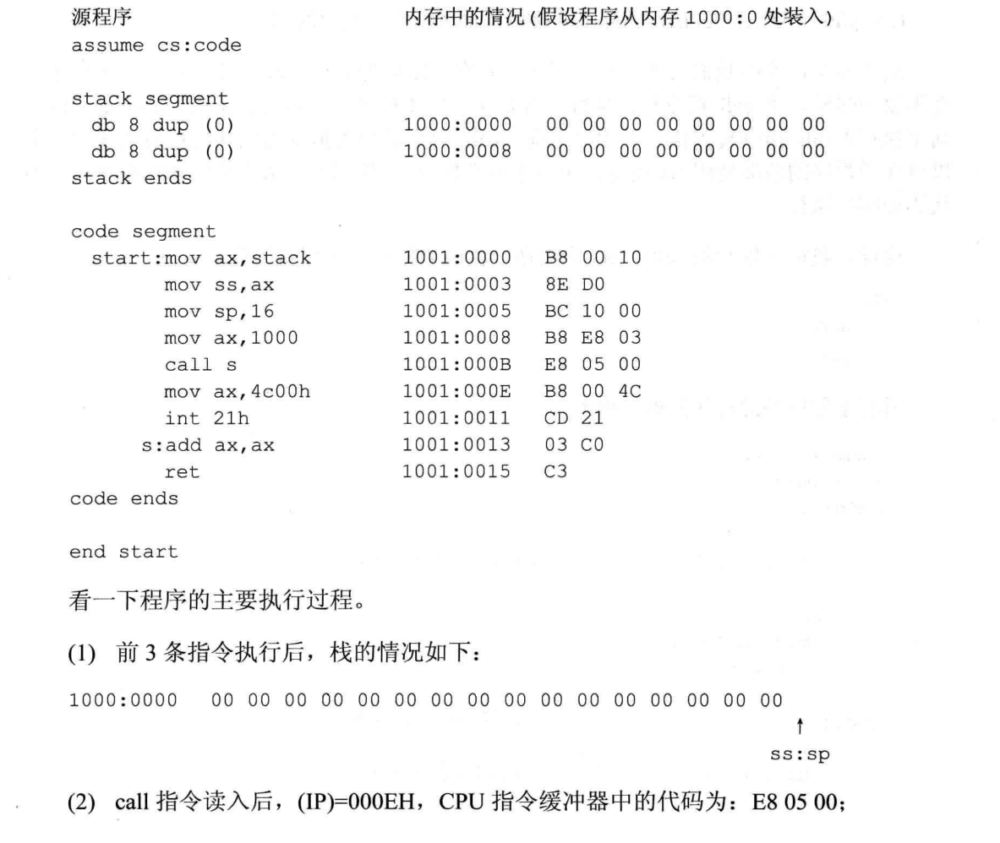
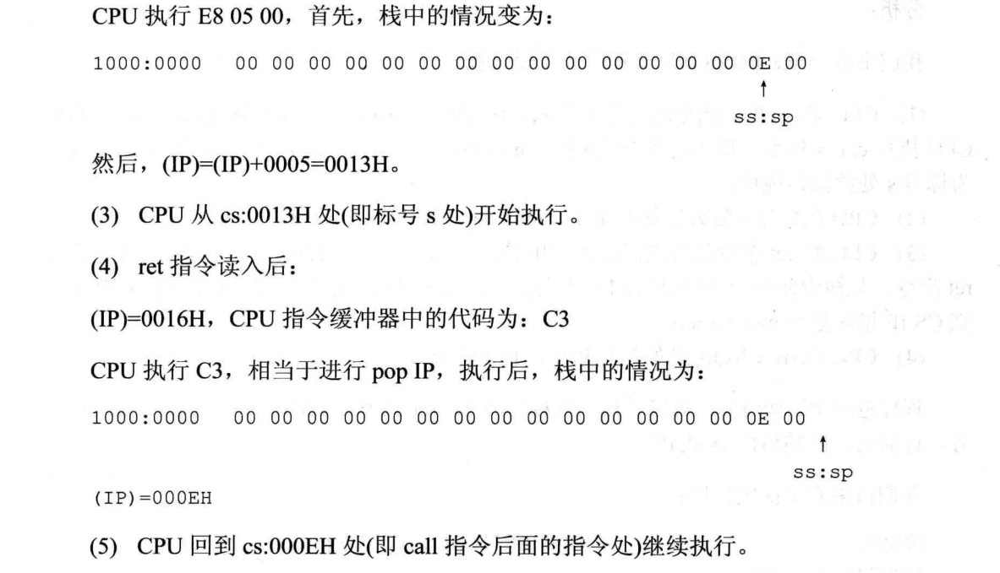
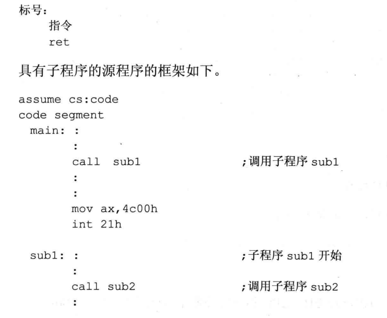
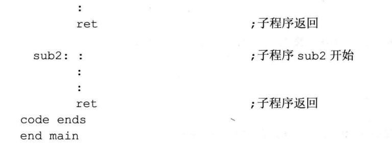

## call 和ret 的配合使用

### 问题:
- 下面程序返回前，bx中的值是多少？
```asm
assume cs:code
code segment

    start: mov ax,1
    mov cx,3
    call s
    mov bx,ax

    mov ax,4c00h
    int 21h

    s: add ax,ax
       loop s
        ret
code ends
end start
```

- 思考后看分析:
  - CPU将call s指令的机器码读入，IP指向了call s后的指令mov bx,ax，然后CPU 执行 call s 指令，将当前的IP值(指令mov bx,ax的偏移地址)压栈，并将IP的值改变为标号s处的偏移地址
  - CPU从标号s处开始执行指令，loop循环完毕后，(ax)=8
  - CPU将ret 指令的机器码读入，IP指向了ret 指令后的内存单元，然后 CPU 执行ret 指令，从栈中弹出一个值(即 call s 先前压入的mov bx,ax 指令的偏移地址)送入IP中。则CS:IP指向指令mov bx,ax
  - CPU从 mov bx,ax 开始执行指令，直至完成。
- 程序返回前，(bx)=8。可以看出，从标号s 到ret 的程序段的作用是计算2的N次方，计算前，N的值由cx提供

- 我们再来看下面的程序:



- 从上面的讨论中我们发现，可以写一个具有一定功能的程序段，我们称其为子程序，在需要的时候，用call 指令转去执行。可是执行完子程序后，如何让 CPU 接着 call 指令向下执行？call 指令转去执行子程序之前，call 指令后面的指令的地址将存储在栈中，所以可在子程序的后面使用 ret 指令，用栈中的数据设置IP的值，从而转到 call 指令后面的代码处继续执行。

- 这样，我们可以利用 call 和ret 来实现子程序的机制。子程序的框架如下:



- 现在，可以从子程序的角度，回过头来再看一下前面的两个程序