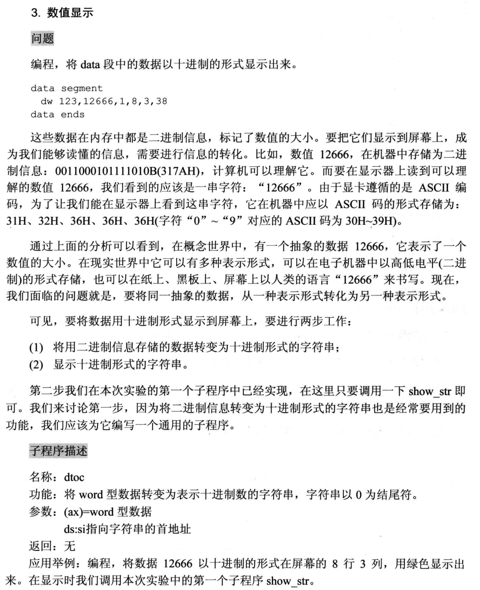
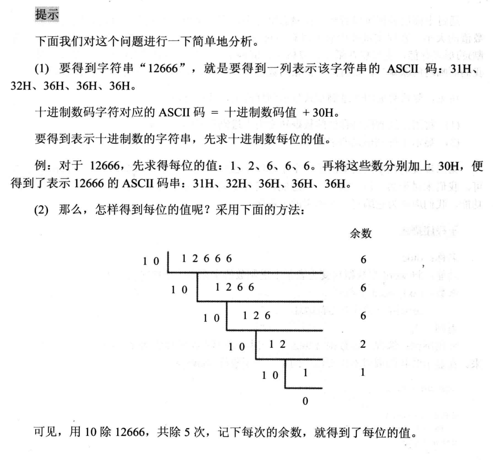
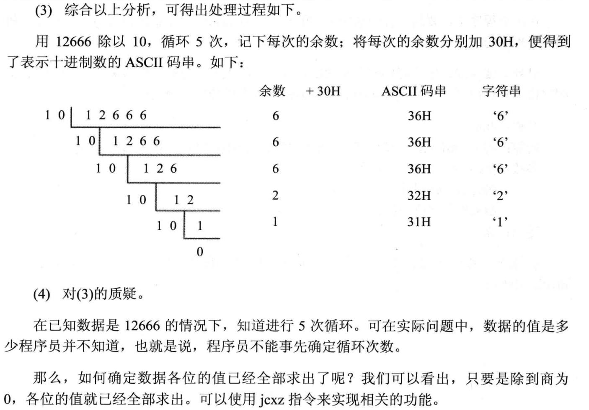

## 数值显示

```asm
assume cs:code
data segment
    db 10 dup (0)
data ends

code segment
    start: mov ax,12666
    mov bx,data 
    mov ds,bx 
    mov si,0 
    call dtoc
    
    mov dh,8
    mov dl,3
    mov cl,2 
    call show_str
    :
    :
    :
code ends 
end start
```



