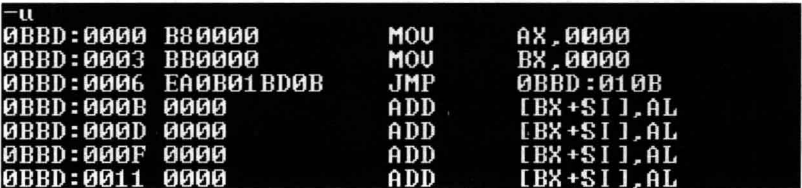

## 转移目的指令在指令中的jmp指令

```asm
    jmp far ptr 标号
    ;上面指令实现的是段转移，又称远转移。 
```
- far ptr 指明了指令用标号的段地址和偏移地址修改CS和IP
  - 下面以程序9.3举例:
    ```asm
    assume cs: codesg
        codesg segment

        start: mov ax,0
        mov bx,0 
        
        jmp far ptr s 
        db 256 dup (0)

        s: add ax,1 
        inc ax
        codesg ends
        
        end start
    ```
- 在Debug中将程序9.3翻译成机器码:
 
- 如上图所示,源程序中的 db 256 dup (0)，被 Debug 解释为相应的若干条汇编指令。这不是关键，关键是，我们要注意一下 jmp far ptr s 所对应的机器码：EA 0B 01 BD 0B，其中包含转移的目的地址。“0B 01 BD 0B”是目的地址在指令中的存储顺序，高地址的“BD 0B”是转移的段地址：0BBDH，低地址的“0B 01”是偏移地址：010BH