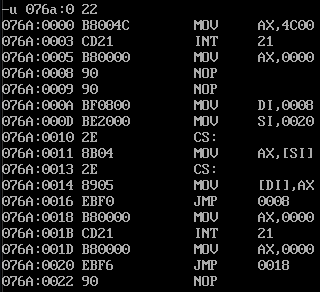

##实验8分析
- 将汇编代码编译成.exe，debug加载进去之后，看机器码如下图所示：
  - 

- 代码正常从start开始运行：
  - 执行对寄存器AX赋值为0，然后两条nop指令到重点分析的地方：
  ```asm
       mov di,offset s
       mov si,offset s2
       mov ax,cs:[si]
       mov cs:[di],ax
  ```
  - offset操作符取出标号 s 的偏移地址存到寄存器 di 中 ，di=0008
  -  offset操作符取出标号 s2 的偏移地址存到寄存器 si 中 ，si=0020
  - 将地址为cs:[0020]内存单元中的数据放到寄存器ax中，即ax=EBF6
  - 将寄存器ax中的数据放到地址为cs:[0008]的内存单元中去，此时0008处的内容不再是90 90，而是EBF6
    - 相当于标号S处的代码nop，nop被替换成 jmp short s1。但是cpu执行时只看机器码 EBF6
  - 程序继续执行 jmp short s0，机器码 EBF0，IP指到0018处。CPU执行指令缓冲器中的EBF0，EBF0也是跳转的意思，F0使用的补码在表示：1111 0000，转换成原码符号位不变，其他位取反，然后+1，即1000 1111 + 1 = 1001 0000 （-10H），此时 IP（0018H - 10H = 8）跳转到0008处
  - 读取指令码 EBF6进入指令缓冲器，IP指向000A，CPU执行 EBF6，又是一个跳转的意思，F6使用补码表示：1111 0110 ，转换成原码符号位不变，其他位取反，然后+1，即1000 1001 + 1 = 1000 1010 （-0AH），此时 IP（000A - 0A = 0）跳转到 cs:0000 处 执行两条命令之后结束

- 反思：
  - 理解jmp 跳转的是按照 位移量（相对地址）进行，并不是标号 或者 是偏移量进行
  - 执行的时候，要以机器语言（二进制码）的执行方式思考，尽量减少 汇编 代码对人思考的影响

