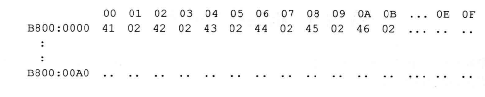
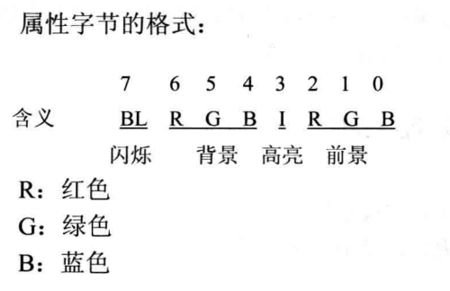
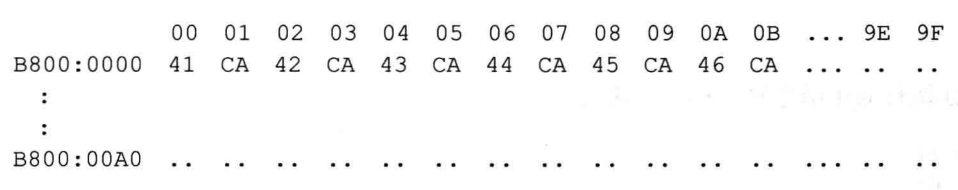

##实验9 根据材料编程

### 编程：在屏幕中间分别显示绿色、绿底红色、白底蓝色的字符串 'welcome to masm!'
- 编程所需的知识通过阅读、分析下面的材料获得
  - 80x25 彩色字符模式显示缓冲区(以下简称为显示缓冲区)的结构：
    - 内存地址空间中，B8000H~BFFFFH 共 32KB 的空间，为 80×25 彩色字符模式的显示缓冲区。向这个地址空间写入数据，写入的内容将立即出现在显示器上
    - 在80x25 彩色字符模式下，显示器可以显示 25行，每行80个字符，每个字符可以有256 种属性(背景色、前景色、闪烁、高亮等组合信息）
    - 这样，一个字符在显示缓冲区中就要占两个字节，分别存放字符的 ASCII 码和属性
    - 80×25模式下，一屏的内容在显示缓冲区中共古 4000 个字节
    - 显示缓冲区分为 8页，每页 4KB（约4000B），显示器可以显示任意一页的内容。一般情况下，显示第口页的内容。也就是说通常情况下，B8000H~B8F9FH 中的 4000 个字节的内容将出现在显示器上
    - 在一页显示缓冲区中：
      - 偏移 000~09F 对应显示器上的第工行(80 个字符占 160个字节）
      - 偏移 0A0~13F 对应显示器上的第2行；
      - 偏移 140~1DF 对应显示器上的第3行；
    - 依此类推，可知，偏移 FOO~F9F 对应显示器上的第25行
      - 在一行中，一个字符占两个字节的存储空间(一个字)，低位字节存储字符的 ASCII码，高位字节存储字符的属性。一行共有80个字符，占160个字节
      - 即在一行中：
        - 00~01 单元对应显示器上的第 1列
        - 02~03单元对应显示器上的第2列
        - 04~05 单元对应显示器上的第了列
        - 依此类推，可知，9E~9F 单元对应显示器上的第80列
        - 例：在显示器的0行0列显示黑低绿色的字符串'ABCDEF（A'的 ASCII 码值为 41H，02H 表示黑底绿色）
 
    
    - 显示缓冲区里的内容为：
        
      - 可以看出，在显示缓冲区中，偶地址存放字符，奇地址存放宇符的颜色属性。
 

    - 一个在屏幕上显示的字符，具有前景(字符色)和背景(底色)两种颜色，字符还可以以高亮度和闪烁的方式显示。前景色、背景色、闪烁、高亮等信息被记录在属性字节中。
    - 属性字节的格式：
    - 
    - 可以按位设置属性字节，从而配出各种不同的前景色和背景色。
    - 比如：
        - 红底绿字，属性字节为：01000010B；
        - 红底闪烁绿字，属性字节为：11000010B;
        - 红底高亮绿字，属性字节为：01001010B；
        - 黑底白字，属性字节为：00000111B；
        - 白底蓝字，属性字节为：01110001B。
        - 例：在显示器的。行0列显示红底高亮闪烁绿色的字符串'ABCDEF'(红底高亮闪烁绿色，属性字节为：11001010B， CAH)
    - 显示缓冲区里的内容为：
    - 